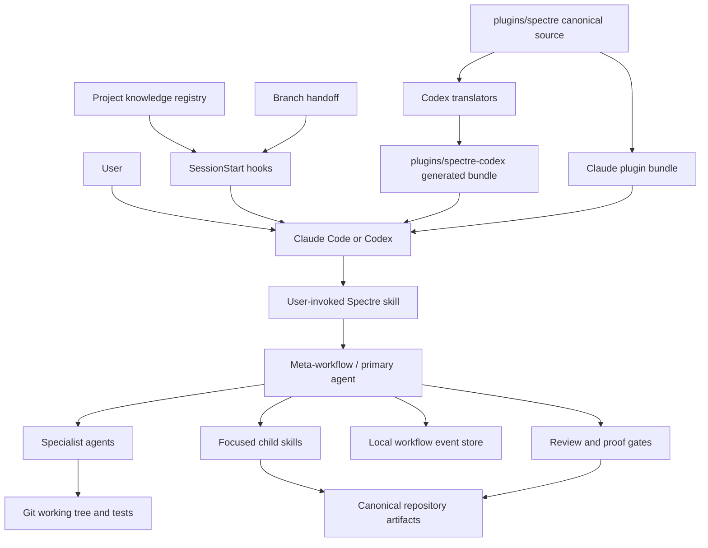
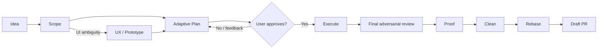
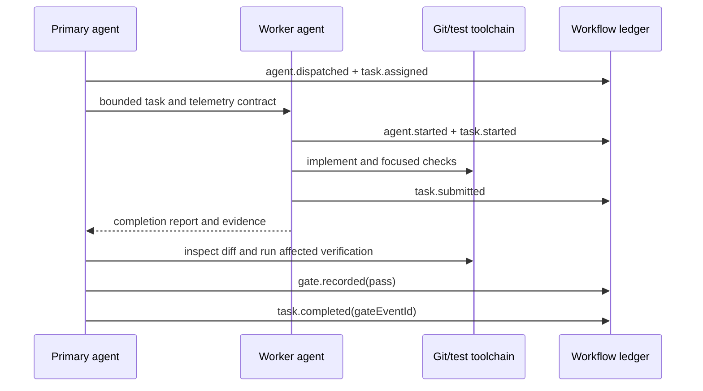
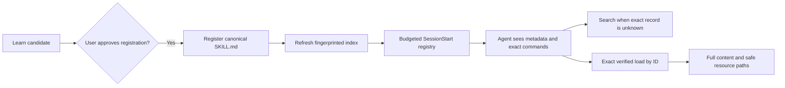

# Spectre Architecture

> Architecture reference for Spectre v7.2.0. This document describes the system implemented in this repository, distinguishes current architecture from possible future products, and includes an interview-oriented explanation of the important design choices.

## 1. Executive summary

Spectre is a local-first, contract-driven orchestration layer for AI coding agents. It is distributed as native Claude Code and Codex plugins and runs inside those hosts; it is not a hosted service, model provider, IDE, or long-running daemon. Its job is to turn ambiguous product work into durable intent, delegate bounded implementation to specialist agents, verify the result, preserve continuity across context windows, and make acceptance evidence reviewable.

The architecture has four central ideas:

1. **Contracts drive orchestration.** Markdown skills define explicit inputs, working sets, outputs, completion conditions, handoffs, and escalation rules. Meta-workflows compose smaller skills and specialist agents.
2. **Authority is separated by concern.** Scope, plans, and task graphs define intent; Git defines source code; the workflow event store defines execution progress; verification gates define technical acceptance; proof artifacts define user-facing acceptance.
3. **The runtime is local and durable.** Repository artifacts live under `.spectre/`; branch handoffs preserve session continuity; project-scoped knowledge and workflow ledgers live under `~/.spectre/projects/` (or `SPECTRE_HOME`).
4. **One canonical implementation supports two hosts.** `plugins/spectre/` is the source of truth. A deterministic translation pipeline generates `plugins/spectre-codex/`, adapting command syntax, agent definitions, models, sandbox permissions, hooks, and manifests without maintaining two independent products.



## 2. System boundaries

### Spectre owns

- Workflow contracts and routing from scope through planning, execution, proof, and shipping.
- Specialist agent definitions and least-privilege role boundaries.
- Durable feature, bug, review, validation, and proof artifacts.
- Local execution telemetry, task-state projection, resume behavior, retention, and cleanup.
- Branch-keyed session handoffs.
- Project knowledge registration, indexing, search, verified loading, and startup registry injection.
- Host-portable plugin generation and distribution metadata.

### The host owns

- The model session and context window.
- Tool execution, permission prompts, sandbox enforcement, and subagent scheduling.
- Native plugin discovery and invocation syntax.
- Authentication to external tools and services.

### The repository and toolchain own

- Source-of-truth code and commit history.
- Builds, tests, linting, type checking, application harnesses, and deployment.
- Product-specific acceptance surfaces.

### Explicit non-goals in the current implementation

- No central orchestration server, remote database, message broker, or cloud control plane.
- No bundled model inference or provider abstraction API.
- No GUI or Spectre Home runtime in this repository.
- No cross-user collaborative workflow state.
- No attempt to replace Git, the host's permission model, or a project's native test stack.

These boundaries keep Spectre portable and easy to install, but they also mean runtime quality depends partly on the host honoring skill and subagent contracts.

## 3. Architectural planes

Spectre can be understood as five cooperating planes.

| Plane | Responsibility | Main implementation |
| --- | --- | --- |
| Distribution | Package and install host-native plugins | `.claude-plugin/`, `.agents/plugins/`, `package.json`, `scripts/sync-codex.cjs` |
| Orchestration | Interpret user intent, route workflows, delegate work, enforce gates | `plugins/spectre/skills/` |
| Execution | Perform bounded research, implementation, testing, and review | `plugins/spectre/agents/` |
| State and evidence | Preserve definitions, execution progress, knowledge, handoffs, and proof | `.spectre/`, `~/.spectre/projects/`, workflow and knowledge helpers |
| Operations | Session startup, CLIs, retention, migration, health checks, release verification | `plugins/spectre/hooks/`, `plugins/spectre/bin/`, `src/`, `scripts/` |

### 3.1 Distribution plane

The repository publishes two native plugin projections:

- **Claude Code:** `.claude-plugin/marketplace.json` points to `plugins/spectre/`.
- **Codex:** `.agents/plugins/marketplace.json` points to the generated `plugins/spectre-codex/` bundle.

The npm package also exposes `bin/spectre.js`. In the current native-plugin architecture, `spectre install|update|uninstall codex` intentionally refuses to mutate Codex files and tells the user to use native marketplace commands. The npm CLI remains useful for `doctor`, the neutral knowledge API, and the workflow API.

### 3.2 Orchestration plane

The 32 skill directories under `plugins/spectre/skills/` are executable contracts. User-facing skills such as `spectre-scope`, `spectre-plan`, `spectre-execute`, and `spectre-ship` coordinate internal skills and subagents. Internal skills such as `spectre-plan-route`, `spectre-feature-root`, and `spectre-fix-core` centralize policies that should not be duplicated.

A compact skill contract normally contains:

- Purpose
- Inputs
- Working Set
- Outputs + DONE
- Method / guardrails
- Handoff
- Escalate-If

This is effectively a prompt-level type system: each workflow states what it may consume, what it may mutate, what proves completion, and where control goes next.

### 3.3 Execution plane

Eight canonical specialist agents divide work by capability and privilege:

| Agent | Role | Default access model |
| --- | --- | --- |
| `finder` | Locate relevant code and artifacts | Read-only |
| `analyst` | Trace code paths and behavior | Read-only |
| `patterns` | Find reusable in-repository implementations | Read-only |
| `web-research` | Verify external, current, or third-party facts | Read-only plus web |
| `reviewer` | Adversarial review of plans, tasks, or diffs | Read-only |
| `dev` | Implement an already-scoped task | Workspace write |
| `tester` | Add behavioral tests or diagnose failures | Workspace write |
| `sync` | Consolidate multi-session handoff history | Scoped write |

The primary agent is an orchestrator and acceptance authority, not the default implementer. During structured execution, planned work is delegated to `dev`; the primary independently verifies and accepts or rejects the result. This separation reduces self-review bias and prevents the primary context from being flooded with implementation detail.

### 3.4 State and evidence plane

Spectre uses two storage domains:

- **Repository-local canonical artifacts** under `.spectre/` describe the work and its reviewed evidence.
- **User-local operational state** under `${SPECTRE_HOME:-~/.spectre}/projects/` tracks knowledge and workflow execution without polluting commits.

This distinction is intentional: team-reviewable intent and proof may be versioned, while high-churn runtime ledgers, locks, and projections remain local.

### 3.5 Operations plane

Node.js helpers provide deterministic behavior that should not depend on an LLM following prose perfectly:

- SessionStart bootstrapping, handoff injection, and knowledge registry injection.
- Workflow event validation, persistence, status projection, cleanup, and purge.
- Knowledge parsing, fingerprinting, registration, search, loading, activity tracking, and migration.
- Host translation and bundle verification.
- CLI health checks and release-boundary checks.

## 4. Repository architecture

```text
spectre/
├── .claude-plugin/                 # Claude marketplace registration
├── .agents/plugins/                # Codex marketplace registration
├── bin/spectre.js                  # npm CLI entry point
├── src/                            # CLI, doctor, legacy install support, tests
├── plugins/
│   ├── spectre/                    # Canonical plugin source
│   │   ├── .claude-plugin/         # Canonical plugin manifest
│   │   ├── agents/                 # Canonical specialist definitions
│   │   ├── bin/                    # Bundled neutral CLI shims
│   │   ├── hooks/                  # SessionStart config and runtime helpers
│   │   └── skills/                 # Workflow contracts and references
│   └── spectre-codex/              # Generated Codex projection; never hand-edit
├── scripts/
│   ├── sync-codex.cjs              # Deterministic generation/check driver
│   ├── translators/                # Manifest, agent, skill, and hook adapters
│   └── check-repository-boundary.mjs
├── test/                            # Cross-cutting contract/evaluator tests
├── AGENTS.md                        # Codex-facing contributor rules
├── CLAUDE.md                        # Claude-facing contributor rules
└── Architecture.md                  # This document
```

The most important repository invariant is one-way authority:

```text
plugins/spectre/  ──translate──>  plugins/spectre-codex/
   canonical                           generated
```

If Codex output is wrong, the fix belongs in the canonical source or a translator, never in the generated tree.

## 5. End-to-end product workflow

The normal lifecycle is:



Specialist entry points deliberately bypass this full path when appropriate: `spectre-fix` for bugs, `spectre-research` for read-only technical exploration, `spectre-tdd` for an already-scoped atomic change, and release workflows for release operations.

### 5.1 Scope: define what, not how

`spectre-scope` converts an unstructured request into explicit IN, OUT, ANTI-SCOPE, Maybe, assumptions, and user value. It performs only a small grounding lookup and defers architectural choices to Plan. The output becomes immutable downstream intent unless the user explicitly approves a scope change.

A managed feature or bug gets a collision-safe root:

```text
.spectre/features/<feature>/
.spectre/bugs/<bug>/
```

`spectre-feature-root` validates repository-relative paths, rejects traversal and symlink escape, creates a neutral `feature.json`, and adds no lifecycle or branch identity to that marker.

### 5.2 Plan: adapt ceremony to semantic risk

`spectre-plan` selects an incumbent-first minimum solution in existing `task_context.md` before it renders one durable aligned draft, then scales its evidence depth to semantic risk. The selected record binds owners, admitted complexity, tier-below challenge, and assurance floor; detailed rendering and Plan Review cannot silently add owned complexity outside it. `spectre-plan-route` classifies semantic shape, uncertainty, evidence, protected boundaries, and task-graph risk—not raw file count or sensitive-domain keywords—and uses the completed selection before drafting. Plan presents the draft's requested outcome, approach, decisions, boundaries, risks, verification intent, and ordering constraints, then hands it to Execute with an explicit preflight marker.

| Size | Semantic shape | Required planning output |
| --- | --- | --- |
| XS | Atomic, low uncertainty, no changed protected boundary | Light aligned draft |
| S | Atomic with a protected boundary, or direct and low uncertainty | Light aligned draft |
| M | Atomic/direct with moderate or high uncertainty | Standard aligned draft |
| L | Structured work with ordinary graph risk | Standard aligned draft |
| XL | Structured work with high uncertainty or graph risk | Comprehensive aligned draft |

Scope is the enduring user contract. A missing irreversible decision, Scope change, or contradiction with an explicit design stops the Plan handoff for authority; otherwise launching the handoff command is alignment. Planning telemetry is useful for route analysis, but a telemetry failure degrades observability rather than blocking approved work. Plan also transports the final observed routing record in `task_context.md`, bound to the draft hash and authority hash, so Execute can reuse the same assessment without depending on telemetry.

Legacy route labels remain observational telemetry for compatibility; they no longer describe review or delivery shape of aligned-draft runs.

### 5.3 Execute: dependency-safe parallel work

`spectre-execute` accepts either:

- **Structured mode:** `execute.md` plus a resolvable `tasks.json`.
- **Plan-direct mode:** a readable direct plan, represented at runtime as coarse workstreams.

Any explicit readable plan enters one preparation path whether supplied as a plain path, a Plan handoff, or a legacy direct-header plan. The explicit plan wins over ambient artifacts. No-path calls prefer same-run source evidence, then a plan at the confirmed root, then structured-only fallback. Execute reuses applicable plan-routing records from `task_context.md` and classifies once when absent or materially stale; `--preflight-plan` is only a depth hint. Scope-safe review finalizes the selected plan path, then the observed assessment decides coordination: ATOMIC/DIRECT uses bounded local workstreams and Active Wave state, while STRUCTURED creates the normal task/index pair with finalized plan hash and closed-review evidence. Legacy route labels remain observational telemetry; they no longer describe review or delivery shape.

Preparation and resume evidence lives in the existing local `execution_state.md` envelope as paths, hashes, routing records, review hashes, pair hashes, and resolved source/run identity. Fresh structured selection persists its resolved JSON event source so resubmitting the selected plan returns to the same run. Existing Markdown direct runs preserve their source and workstream ids. Existing JSON runs preserve their source and accepted ids; any source-required definition repair must update the source graph through the adaptation contract before new JSON task ids are emitted. The review reports and hashes finalize the selected plan; task definitions are derivative and remain immutable once generated.

The execution algorithm is:

1. Resolve the feature root and source artifact.
2. Start or resume a durable local run.
3. Rebuild the ready frontier from run state.
4. Dispatch bounded, dependency-safe batches to `dev` agents.
5. Let workers implement, run focused checks, and submit—not accept—their work.
6. Independently inspect the diff and run affected verification in the primary.
7. Record a verification gate and complete covered tasks only after it passes.
8. Route intermediate review only when compounding risk warrants it.
9. After all work is accepted, run one final adversarial review.
10. Repair attributable high-severity findings once, then run end-only proof.
11. Finish the run truthfully and hand off to cleanup or remediation.

Waves are scheduling hints, phases are review boundaries, and actual accepted dependencies determine readiness. This allows parallelism without allowing the task graph to override observed repository reality.

### 5.4 Prove: user-facing acceptance

Verification and proof answer different questions:

- **Verification:** did the changed code pass the relevant technical checks?
- **Review:** is the cumulative implementation correct, secure, connected, reachable, and within scope?
- **Proof:** can the user-observable acceptance criteria be demonstrated with reviewed evidence?

`spectre-prove` emits `proof/proof.json` and mandatory `proof/proof.html`. A self-owned execution run cannot finish as passed without all tasks terminal and a passing proof gate. This makes proof an architectural acceptance boundary rather than a decorative report.

### 5.5 Ship: production handoff

`spectre-ship` composes the closeout path:

1. `spectre-clean` orchestrates pruning, risk-based tests, and sweep/commit hygiene.
2. `spectre-rebase` creates a backup reference, rebases onto the target, and verifies the affected surface.
3. `spectre-create_pr` derives a draft PR from the actual diff and verification summary.

The PR is downstream of accepted implementation and evidence; it is not used as the workflow's state database.

## 6. Execution state architecture

### 6.1 Authority model

| Concern | Authority | Why |
| --- | --- | --- |
| Product boundary | `concepts/scope.md` | Human-approved statement of what is and is not being built |
| Technical design | `specs/plan.md` | Aligned draft, then reviewed implementation intent after Execute preflight |
| Structured work definition | `specs/tasks.json` | Derivative task graph; immutable during execution |
| Compact structured index | `specs/execute.md` | Dispatch-oriented navigation into the task graph |
| Source code | Git working tree and commits | Native repository history and integration surface |
| Execution lifecycle | `events.jsonl` and materialized `state.json` | Durable, resumable record of observed progress |
| Technical acceptance | Passing verification/review gates | Workers cannot self-accept |
| User acceptance | `proof.json`, `proof.html`, and proof gate | Evidence tied to explicit acceptance criteria |

The core rule is that definitions are not progress trackers. `tasks.json` is read as approved input and remains byte-stable; any embedded `status` fields are stripped when computing its definition hash. Mutable task state belongs exclusively to the run ledger.

### 6.2 Event-sourced local store

Workflow state lives below the project store:

```text
${SPECTRE_HOME:-~/.spectre}/projects/<readable-project-identity>/
├── project.json
├── .spectre.lock
├── knowledge/
├── knowledge-index.json
├── knowledge-activity.json
└── workflow/
    ├── execute/
    │   └── runs/
    │       └── run_<uuid>/
    │           ├── events.jsonl  # Append-only authority
    │           ├── state.json    # Materialized current state
    │           └── summary.json  # Terminal compact summary
    ├── plan/
    │   └── events.jsonl          # Observational Plan calibration events
    ├── ship/
    │   └── measurements.json     # Bounded completed Ship summaries
    └── ...retention metadata
```

Project identity prefers Git's common directory, so linked worktrees resolve to the same project store while run metadata still records checkout identity, branch, and HEAD. Outside Git, canonical project paths provide the fallback identity. Execute, Plan, and Ship share this operational boundary but retain separate schemas and authority: Execute owns resumable per-run state, Plan owns the project-wide calibration log, and Ship owns bounded measurement history. None participates in Git merges. Exact feature roots and artifact hashes preserve feature-level joins between the separate stores.

Events include run, stage, phase, wave, agent, task, gate, and human-input transitions. The store validates identifiers, actors, ownership, task transitions, paths, and event payloads before appending.

### 6.3 Primary/worker acceptance protocol



Important invariants enforced in code:

- Only the primary can dispatch agents, record acceptance gates, skip tasks, or complete tasks.
- A worker may start, submit, or block only work assigned to that actor.
- `task.completed` is valid only from `submitted` and requires a passing verification gate covering that task.
- A parent-owned run can finish only as `implementation_ready` after all tasks are terminal.
- A self-owned run can finish as `passed` only after all tasks are terminal and a passing proof gate exists.

### 6.4 Resume and idempotency

`run start` resumes an active or blocked run when checkout, source path, feature root, and execute-contract hash match. `run status` projects every task into five user-facing values:

| Status | Resume rule |
| --- | --- |
| `completed` | Accepted; do not redo |
| `skipped` | Terminally excluded; do not redo |
| `blocked` | Resolve or escalate |
| `in_progress` | Assigned, started, or submitted but unaccepted; redo or verify |
| `pending` | Never dispatched; normal frontier work |

Every value except `completed` and `skipped` is intentionally conservative. Idempotency keys make repeated event calls safe, and a stale read that causes an invalid transition is resolved by re-reading rather than forcing state.

The store uses a per-project lock with timeout and stale-owner recovery. State and JSON metadata use write-fsync-rename atomic replacement; the event log is append-only and can repair an incomplete trailing write.

### 6.5 Retention

SessionStart maintenance invokes workflow cleanup. Default policy:

- Active runs with no events for 7 days are interrupted.
- Raw run data is retained for 30 days.
- Terminal summaries are retained for 90 days.
- Recovery data is retained for 7 days.
- A project store is capped at approximately 25 MiB through deterministic cleanup.

Explicit purge requires `--yes`. Cleanup is scoped to Spectre-owned paths and has a dry-run mode.

## 7. Canonical artifact model

A typical feature root is:

```text
.spectre/features/<feature>/
├── feature.json
├── concepts/
│   └── scope.md
├── ux.md
├── task_context.md
├── specs/
│   ├── plan.md
│   ├── tasks.json
│   └── execute.md
├── reviews/
│   ├── plan_correctness.md
│   ├── plan_review.md
│   ├── task_review.md
│   └── comprehensive_code_review.md
├── validation/
│   └── validation_gaps.md
└── proof/
    ├── proof.json
    └── proof.html
```

Bug workflows use `.spectre/bugs/<bug>/bug-report.md` and related evidence. Branch session continuity is separate at `.spectre/handoffs/<raw-branch>/`.

The feature-root policy keeps specs, research, decisions, reviews, and proof trackable while recommending that noisy execution artifacts such as evidence, checkpoints, run data, markers, and execution projections remain ignored. The repository's ignore policy ultimately controls whether these artifacts are versioned.

## 8. Session continuity architecture

`spectre-handoff` writes a branch-keyed JSON snapshot containing current goal, accomplishments, interrupted work, next steps, decisions, constraints, risks, working files, commands, and Git context. On later sessions, the `sync` agent can consolidate the newest current snapshot with up to three previous snapshots while giving current-session facts priority.

At SessionStart, `handoff-resume.mjs`:

1. Resolves the current project and raw Git branch.
2. Prefers `.spectre/handoffs/<branch>/` as the canonical history.
3. Falls back to the legacy `docs/tasks/<branch>/session_logs/` only when canonical history is absent.
4. Loads the latest handoff and injects formatted `<session-context>` into the host.

`spectre-forget` archives active handoff and todo files for only the current branch. This makes forgetting recoverable and avoids deleting another branch's context.

Handoffs preserve conversational continuity; they do not replace the execution ledger. After compaction, Execute must reload its contract and rebuild progress from the workflow store rather than trusting a prose handoff.

## 9. Project knowledge architecture

Spectre knowledge captures durable, reusable project facts without injecting every record into every prompt.



### 9.1 Record format and storage

Each record is a standards-compatible `SKILL.md` stored under the project store's `knowledge/<record-id>/` directory. Metadata includes category, triggers, status, and positive integer version. Supported states are active, disputed, superseded, and archived. Core record content is size-bounded; larger supporting material belongs in resource files.

Registration is approval-gated. The system validates names, metadata, categories, versions, duplicate triggers, file size, fingerprints, and resource confinement before making a record active.

### 9.2 Registry injection

On startup, clear, and compaction, `load-knowledge.mjs` renders a host-budgeted registry containing only routing metadata:

- Exact record ID and version
- “Use when” description
- Activation cues
- Exact search and load command templates

Records are ranked by verified load activity and source newness, then rendered in stable ID order for host prompt-cache stability. Omitted records remain searchable. Search matches normalized phrases and token overlap across IDs, triggers, and descriptions.

### 9.3 Verified loading and safety

An exact load refreshes the index under a lock, verifies the indexed fingerprint, validates that the record and resources remain inside a canonical non-symlink directory, and then returns the full content plus safe absolute resource paths. If a file changes during verification, loading fails instead of returning a potentially inconsistent record.

This implements progressive disclosure: the agent knows what knowledge exists at low context cost and pays to load details only when the subject and use condition match.

## 10. SessionStart and hook architecture

The canonical hook manifest defines three SessionStart responsibilities:

| Trigger | Hook | Responsibility |
| --- | --- | --- |
| startup, resume, clear, compact | `bootstrap.mjs` | Remove retired plugin files, ensure managed Codex agents when applicable, run workflow retention |
| startup, resume, clear, compact | `handoff-resume.mjs` | Inject latest branch handoff or a bounded welcome message |
| startup, clear, compact | `load-knowledge.mjs` | Inject the budgeted project knowledge registry |

There is no prompt-time `UserPromptSubmit` knowledge matcher. Knowledge discovery is SessionStart metadata plus explicit neutral CLI search/load, which is more portable and easier to reason about.

Hooks communicate with the host through JSON. Maintenance failures are surfaced as bounded system messages and are designed not to corrupt the coding session.

## 11. Cross-host portability

Claude Code is the canonical authoring format. `npm run sync-codex` applies four translators:

1. **Manifest:** generates `.codex-plugin/plugin.json` from canonical and package metadata.
2. **Agents:** converts Markdown/YAML definitions into managed TOML, maps Claude model tiers to Codex models and reasoning effort, and assigns read-only or workspace-write sandbox modes by role.
3. **Skills:** rewrites command, skill, agent, and project-skill references; generates Codex invocation-policy sidecars for skills that disable implicit invocation.
4. **Hooks:** copies portable `.mjs` runtime helpers, rewrites `${CLAUDE_PLUGIN_ROOT}` to `${PLUGIN_ROOT}`, and selects the Codex knowledge host.

Representative syntax translations are:

| Canonical Claude form | Generated Codex form |
| --- | --- |
| `/spectre:foo` | `spectre-foo` / explicit `$spectre-foo` invocation in user guidance |
| `@skill-spectre:spectre-foo` | `Skill(spectre-foo)` |
| `@spectre:tester` | `@spectre_tester` |
| `.claude/skills/` | `.agents/skills/` |
| `spectre-workflow ...` | `node "${PLUGIN_ROOT}/hooks/scripts/workflow-cli.mjs" ...` |

`sync-codex --check` generates into a temporary tree and byte-compares it with `plugins/spectre-codex/`. Stale, missing, extra, or semantically invalid generated files fail the check.

This translation boundary prevents host-specific syntax from leaking into workflow semantics while still allowing each host to use native plugin and agent formats.

## 12. CLI architecture

There are three related command surfaces:

| Surface | Entry point | Role |
| --- | --- | --- |
| npm CLI | `bin/spectre.js` → `src/main.js` | Doctor, knowledge API, workflow API, native-install guidance |
| Bundled workflow shim | `plugins/spectre/bin/spectre-workflow` | Host-neutral access to workflow events and plan telemetry |
| Bundled knowledge shim | `plugins/spectre/bin/spectre-register`, `spectre-migrate`, and `knowledge-cli.mjs` | Host-neutral registration, migration, search, and load |

The workflow CLI is intentionally a typed command surface rather than a generic “write event” endpoint. Commands such as `task submit`, `gate record`, and `run finish` construct validated event specifications, keeping invalid state transitions out of prompt-authored JSON.

## 13. Reliability and security model

Spectre's security boundary is defense in depth rather than a single sandbox:

### Least privilege

- Read-heavy specialists are translated to read-only Codex sandboxes.
- Implementation and test roles receive workspace-write access.
- User-owned design, scope, destructive, and publication decisions remain explicit gates.
- The host still performs the final tool and plugin trust enforcement.

### Path confinement

- Feature roots reject absolute paths, traversal, unmanaged roots, and symlink escape.
- Workflow evidence paths must resolve inside the project.
- Knowledge resources must remain inside a canonical, non-symlink record directory.
- Cleanup and purge operate only on resolved Spectre-owned stores.

### Durable writes and concurrency

- JSON state uses temporary files, `fsync`, and atomic rename.
- Per-project lockfiles serialize knowledge and workflow mutations.
- Stale locks are reclaimed only when expired or their process is no longer alive.
- Event calls support idempotency keys.
- Hashes bind plans, task definitions, execute contracts, and knowledge records to the bytes that were reviewed.

### Fail-closed versus degrade-open

Spectre distinguishes authority from observability:

- Invalid paths, malformed definitions, illegal state transitions, missing approval, or failed acceptance gates stop the affected operation.
- Telemetry or plan-join failures degrade observation but do not erase valid implementation evidence or block otherwise authorized work.
- A worker report is treated as a lead, never as acceptance.
- A failed check records a failed gate; it never rewrites history.

## 14. Testing and release architecture

The repository uses Node's built-in test runner across four broad layers:

1. **Unit and contract tests** for CLI, configuration, project identity, knowledge, workflow transitions, hooks, and retention.
2. **Translation tests** for agent TOML, skill rewrites, hook roots, manifests, stale-file removal, and byte-stable sync.
3. **Package tests** that build and install the npm tarball, verify both host bundles, reject checkout-specific paths, and exercise the neutral runtime from the packed artifact.
4. **Workflow quality tests** for task-review safety, evaluators, fixtures, and production contracts.

The normal change gate is:

```bash
git status --short --branch
npm run sync-codex -- --quiet
npm run sync-codex -- --check --quiet
npm test
git diff --check
```

`scripts/check-repository-boundary.mjs` additionally prevents studio-only/private paths, repository tests, and untracked files from entering the public package. Release tooling verifies structure, tests, Codex translation, real CLI behavior, and release readiness before activation or publication.

Version metadata is repeated across npm and both marketplace manifests for host compatibility, so release verification must keep those surfaces aligned.

## 15. Key design decisions and tradeoffs

### Contract-driven workflows instead of a hard-coded orchestrator

**Decision:** Keep high-level policy in compact, versioned skill contracts while moving deterministic state validation into code.

**Benefit:** Workflows remain legible, adaptable, and host-native; policy changes do not require a service deployment.

**Tradeoff:** LLM compliance is probabilistic, so load-bearing invariants must be reinforced by explicit DONE clauses, independent agents, typed CLIs, and state-machine validation.

### Immutable intent plus event-sourced progress

**Decision:** Never use task-definition documents as the mutable execution database.

**Benefit:** Human-approved artifacts remain auditable and resumable; progress survives compaction without ambiguous status edits.

**Tradeoff:** Users need a projection such as `run status` to see current progress, and retention means old raw ledgers are not permanent history.

### Local-first storage

**Decision:** Store operational state on the developer's machine and canonical work products in the repository.

**Benefit:** No service dependency, credentials, network latency, or customer-code upload is required.

**Tradeoff:** Runtime state is not automatically shared across machines or teammates and needs explicit artifact/commit handoff where collaboration is required.

### Primary acceptance separated from worker implementation

**Decision:** Workers submit; the primary verifies and accepts.

**Benefit:** Reduces self-certification and makes passing technical gates a mechanically enforced prerequisite for completion.

**Tradeoff:** Independent verification adds latency and model/tool cost.

### One canonical source with generated host projections

**Decision:** Author once for Claude-style canonical source and deterministically generate Codex.

**Benefit:** Prevents semantic drift and enables byte-level parity checks.

**Tradeoff:** Translator correctness becomes release-critical, and new host capabilities require deliberate mapping.

### End-only proof

**Decision:** Perform focused verification during waves but generate one final acceptance proof over the final candidate.

**Benefit:** Avoids evidence bloat and proves the actual cumulative user experience.

**Tradeoff:** Some user-facing defects are discovered late; intermediate review is therefore risk-routed where errors could compound.

## 16. Extension points

### Add a workflow skill

Create `plugins/spectre/skills/<skill>/SKILL.md` using the contract form, compose existing focused skills when possible, and regenerate Codex. Add deterministic code only where prose cannot safely enforce the invariant.

### Add a specialist agent

Create a canonical Markdown definition in `plugins/spectre/agents/`, assign the smallest tool set and sandbox role, add its Claude-model-to-Codex mapping if necessary, and verify generated TOML plus dispatch behavior.

### Add workflow state

Prefer a new typed event and projection over mutating definitions. Update event validation, `applyEvent`, summary/projection logic, CLI construction, retention behavior if necessary, and state-machine tests.

### Add durable knowledge behavior

Preserve the registry/search/exact-load separation. Extend record parsing or activity only with fingerprint, locking, path-confinement, payload-budget, and migration tests.

### Add another host

Implement a new deterministic projection from the canonical plugin rather than forking workflow content. Map manifest shape, invocation syntax, agent definitions, model tiers, permissions, hooks, and native distribution.

## 17. Current constraints and risks

- **Host dependence:** Subagent dispatch, context behavior, and tool permissions vary across Claude Code and Codex despite translated contracts.
- **Prompt enforcement:** Not every workflow rule can be mechanically enforced; critical state and acceptance rules are, but orchestration sequencing still relies on the primary agent.
- **Local state availability:** Resume requires the same project store; moving machines without copying local state loses operational history, though canonical repository artifacts remain.
- **No multi-user concurrency protocol:** Locking protects local processes, not distributed collaborators.
- **Schema evolution:** Workflow state is currently schema version 1; incompatible future changes require explicit migration or version handling.
- **External proof capability:** Some acceptance journeys require credentials, a browser/app harness, or another tool outside Spectre.
- **Generated-bundle coupling:** Translator defects can affect every Codex consumer, which is why sync and packed-artifact tests are release gates.

## 18. Interview-ready explanation

### 30-second version

> Spectre is a local-first orchestration system for coding agents. It turns product intent into immutable scope, plan, and task contracts; delegates bounded work to least-privilege specialist agents; and uses an event-sourced local ledger so progress survives context loss without mutating the approved task graph. Workers can submit work, but only the primary can accept it after independent verification, and a self-owned run cannot pass without reviewed user-facing proof. We author one canonical Claude-style plugin and deterministically generate a native Codex plugin, which gives us portability without maintaining two semantic implementations.

### Five architecture points to emphasize

1. **Clear sources of truth:** intent, code, execution state, and acceptance evidence each have a different authority.
2. **Human authority is explicit:** scope, material design choices, destructive operations, and pre-code approval are gates, not inferred permissions.
3. **Durability is designed in:** event logs, projections, hashes, idempotency, atomic writes, locks, handoffs, and exact knowledge loading handle long-running, compacted sessions.
4. **Quality is systemic:** specialist roles, independent verification, adversarial review, risk-based tests, and final proof prevent “agent says done” from meaning “done.”
5. **Portability is a build problem:** host differences are translated and verified at release time instead of leaking into every workflow.

### Useful Microsoft-style tradeoff discussion

If asked why Spectre does not use a service or database, explain that the current target is an individual developer operating inside an existing AI coding host. Local files minimize trust surface, deployment burden, latency, and customer-code movement. A service becomes justified when the product needs cross-machine resume, team coordination, centralized policy, fleet analytics, or remote execution; at that point the event model is the natural synchronization boundary, while canonical repository artifacts can remain unchanged.

If asked how this scales, distinguish three dimensions:

- **Task scale:** dependency-safe waves and bounded agents parallelize independent work.
- **Context scale:** agents receive narrow slices, durable artifacts hold decisions, and the ledger rebuilds the frontier after compaction.
- **Host scale:** deterministic adapters project one semantic source into multiple native plugin formats.

If asked about consistency, explain that Spectre uses local serializability rather than distributed consistency: a per-project lock serializes mutations, the append-only log is authoritative, `state.json` is a materialized projection, and idempotency keys make retries safe. A distributed version would preserve those event semantics but add globally unique writers, optimistic concurrency/version checks, and replicated projections.

## 19. Glossary

| Term | Meaning |
| --- | --- |
| Canonical source | `plugins/spectre/`, the only hand-maintained plugin implementation |
| Generated bundle | `plugins/spectre-codex/`, the deterministic Codex projection |
| Skill | A contract-form prompt that owns one workflow or bounded capability |
| Meta-workflow | A skill that orchestrates child skills and specialist agents |
| Primary | The user-facing orchestrator and acceptance authority |
| Worker | A bounded subagent that performs and submits assigned work |
| Feature root | One managed `.spectre/features/<name>/` or `.spectre/bugs/<name>/` workspace |
| Source artifact | Immutable task graph or plan used to start execution |
| Run ledger | Append-only `events.jsonl` plus materialized `state.json` |
| Gate | Typed verification, review, proof, or human-authority checkpoint |
| Plan-direct | Execution directly from a readable plan using coarse workstreams |
| Structured mode | Execution from `execute.md` plus `tasks.json` |
| Knowledge registry | Size-bounded SessionStart metadata describing loadable records |
| Proof | Reviewed evidence that the final candidate satisfies user-facing acceptance criteria |

## 20. Code-reading map

For a fast architecture review before an interview, read in this order:

1. `README.md` — product lifecycle and canonical artifacts.
2. `plugins/spectre/skills/spectre-plan/SKILL.md` — adaptive planning and approval model.
3. `plugins/spectre/skills/spectre-execute/SKILL.md` — orchestration and finalization model.
4. `plugins/spectre/hooks/scripts/workflow/store.mjs` — execution state machine and authority enforcement.
5. `plugins/spectre/hooks/scripts/workflow-cli.mjs` — typed operational surface.
6. `plugins/spectre/hooks/scripts/knowledge/registry.mjs` and `loader.mjs` — progressive-disclosure knowledge design.
7. `plugins/spectre/hooks/hooks.json` — SessionStart composition.
8. `scripts/sync-codex.cjs` and `scripts/translators/` — cross-host build architecture.
9. `src/main.js` and `src/lib/doctor.js` — npm CLI and installation diagnostics.
10. `scripts/test_sync-codex.cjs`, `src/workflow-cli.test.js`, and `src/pack.test.js` — executable architecture contracts.
